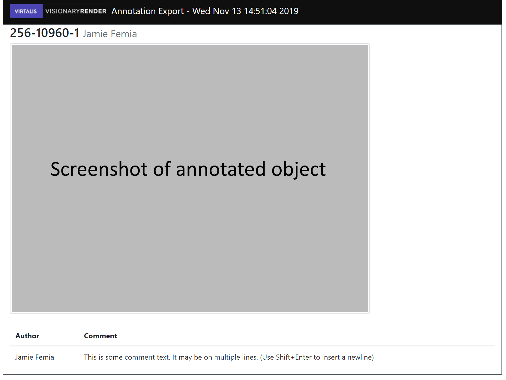

# Annotation Exporter
This is an example implementation of a Visionary Render plugin which exports annotation data from a scene and saves it as either HTML or XML, using a simple template engine (https://github.com/FSMaxB/liluat). This plugin also has a copy of bootstrap (https://getbootstrap.com/) in order to style some HTML components.

Images of the viewpoints associated with each annotation are also saved as .png files in a folder next to the saved output files.

The HTML output includes some supplementary files to improve the appearance of the document.

## Installation
To install the plugin, download this repository and use Settings -> Plugins -> Add Plugin to install it into Visionary Render.

If you are unable to directly import the .zip, you may need to extract the contents to `(documents dir)/Visionary Render <version>/plugins` and make sure the outer folder is called "example-annotation-plugin".

## Usage
Once installed, this plugin adds a option to the File menu (File -> Export -> Annotation Exporter)

Select this option and specify an output file name and type.

## Example HTML Output


## Example XML Output
For an XML file saved to `D:\Temp\annotationexport\test1\test1.xml`
```xml
<annotations exported="Fri Aug 23 09:49:15 2019">
  <annotation name="256-10960-1" author="Jamie Femia">
    <viewpoint position="-1.198364, 0.736352, 1.881085" rotation = "334.118332, 330.266850, 0.000000">
      <texture filename="D:\Temp\annotationexport\test1\viewpoint-1.png" />
    </viewpoint>
    <comment author="Jamie Femia">Hello</comment>
    <comment author="Jamie Femia">Some other comment</comment>
  </annotation>
  <annotation name="256-10960-1" author="Jamie Femia">
    <viewpoint position="1.721224, 0.897960, 1.279293" rotation = "329.521447, 65.301871, 0.000000">
      <texture filename="D:\Temp\annotationexport\test1\viewpoint-2.png" />
    </viewpoint>
    <comment author="Jamie Femia">Another annotation</comment>
  </annotation>
</annotations>
```

## License
MIT